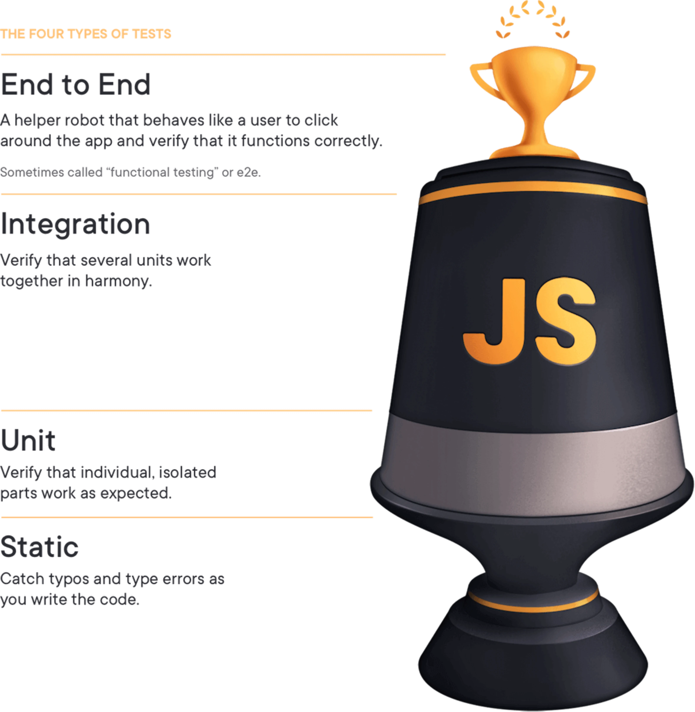

# Homework 4

### Static vs Unit vs Integration vs E2E Testing for Frontend Apps

- End to End: A helper robot that behaves like a user to click around the app and verify that it functions correctly. Sometimes called "functional testing" or e2e.
- Integration: Verify that several units work together in harmony.
- Unit: Verify that individual, isolated parts work as expected.
- Static: Catch typos and type errors as you write the code.

Integration tests and End to End seem very very similar?

The biggest and most important reason that I write tests is CONFIDENCE.

As you move up the testing trophy, the tests become more costly.

##### Trade offs

- The higher up the trophy you go, the more points of failure there are and therefore the more likely it is that a test will break, leading to more time needed to analyze and fix the tests.

- As you move up the testing trophy, the tests typically run slower.

- Confidence: Simple problems 👌 ➡ Big problems 😖

- If you're operating at a low level you need more tests to cover the same number of lines of code in your application as a single test could higher up the trophy.
